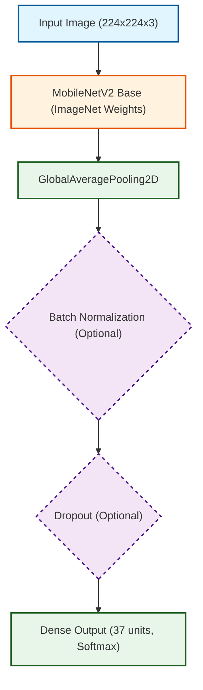

# MobileNetV2 Transfer Learning and CNN Study on Oxford-IIIT Pet

This project contains a Jupyter notebook experiment for training, fine-tuning, evaluating, and documenting a MobileNetV2-based image classifier on the Oxford-IIIT Pet dataset using TensorFlow/Keras and TensorFlow Datasets (TFDS).

The notebook conducts an extensive study on CNN design choices including weight initialization, regularization, optimizers, learning rate, batch size, and compares feature extraction with fine-tuning. It utilizes 5-fold stratified cross-validation to select the best hyperparameter configuration and evaluates the final model with classification metrics, saving visual artifacts for analysis.

## Project Structure

```text
.
├── README.md
├── requirements.txt
├── report5.pdf
├── mobilenetv2_cnn_study.ipynb
└── images/
    ├── 1_weight_init_loss.png
    ├── 2_weight_init_accuracy.png
    ├── 3_regularization_accuracy.png
    ├── 4_regularization_loss.png
    ├── 5_batch_normalization.png
    ├── 6_optimizers_loss.png
    ├── 7_optimizers_accuracy.png
    ├── 8_learning_rate.png
    ├── 9_batch_size.png
    ├── 10_dropout_rate.png
    ├── 11_feature_extraction_vs_finetuning.png
    ├── 12_transfer_learning_loss.png
    ├── 13_cross_validation_accuracy.png
    ├── 14_confusion_matrix.png
    └── 15_misclassified_images.png
```

## Main Notebook

The current notebook is:

```text
mobilenetv2_cnn_study.ipynb
```

It performs the following workflow:

1. Imports TensorFlow, NumPy, Matplotlib, scikit-learn metrics, and TFDS utilities.
2. Creates the `images/` and `tensorflow_datasets/` output directories if they do not already exist.
3. Checks whether TensorFlow detects a GPU and configures mixed precision.
4. Downloads and loads the Oxford-IIIT Pet dataset with TFDS.
5. Resizes images to 224x224 and normalizes them with MobileNetV2 preprocessing.
6. Splits data into development and validation sets.
7. Precomputes frozen ImageNet MobileNetV2 representations to accelerate training.
8. Studies the effect of weight initialization strategies (Zero, Random, Xavier, He).
9. Studies the effect of regularization techniques (None, L2, Dropout, Batch Normalization).
10. Compares optimization algorithms (SGD, Momentum, RMSProp, Adam).
11. Performs hyperparameter exploration for learning rate, batch size, and dropout.
12. Conducts a 5-fold cross-validation over selected hyperparameter configurations.
13. Retrains the best configuration (Feature Extraction, lr=0.001, dropout=0.25, batch=16) on the full development set.
14. Evaluates the final model on the independent test set with accuracy, precision, recall, and F1-score.
15. Saves a confusion matrix and misclassified-image examples.
16. Creates a `report_images.zip` archive from the generated images.

## Dataset

The experiment uses the Oxford-IIIT Pet dataset, loaded via TensorFlow Datasets, with:

- 3,680 training images
- 3,669 test images
- 37 balanced classes of pet categories
- Preprocessing: Images are resized to 224x224 and normalized.

TensorFlow Datasets downloads the dataset automatically on the first run.

## Model Architecture

The main classifier is built with:

- `tf.keras.applications.MobileNetV2`
- ImageNet pretrained weights (for fine-tuning and feature extraction)
- `include_top=False`
- `input_shape=(224, 224, 3)`
- `GlobalAveragePooling2D`
- Custom classification head with optional Batch Normalization and Dropout
- `Dense(37, activation="softmax")`



## Training Procedure

The notebook executes multiple short exploratory runs across different phases:

### Phase 1: CNN Design Choices
- **Initialization**: Compares Zero, Random, Xavier, and He initialization.
- **Regularization**: Compares Baseline, L2, Dropout, and Batch Normalization.
- **Optimizers**: Compares SGD, Momentum, RMSProp, and Adam.

### Phase 2: Hyperparameter Tuning and Cross-Validation
- Evaluates various learning rates, batch sizes, and dropout values.
- Compares feature extraction vs. partial fine-tuning.
- Performs 5-fold stratified cross-validation on a selected set of configurations.

### Phase 3: Final Training
The best configuration selected via 5-fold CV is used for final training:
- Approach: Feature Extraction
- Optimizer: Adam
- Learning rate: `0.001`
- Batch size: `16`
- Dropout: `0.25`
- Epochs: `6`

## Recorded Results

The selected optimal hyperparameter configuration (`C2`) achieved a Mean CV Accuracy of approximately 89.67% during 5-fold cross-validation.

The final evaluation on the fully independent test set resulted in:

```text
Accuracy:  0.8858
Precision: 0.8936
Recall:    0.8858
F1-score:  0.8859
```

The final recorded test accuracy is approximately 88.58%.

## Generated Outputs

The notebook writes the following visual outputs to `images/`:

| File | Description |
| --- | --- |
| `images/1_weight_init_loss.png` | Training loss comparison for weight initialization |
| `images/2_weight_init_accuracy.png` | Validation accuracy for weight initialization |
| `images/3_regularization_accuracy.png` | Training and validation accuracy for regularization strategies |
| `images/4_regularization_loss.png` | Training and validation loss for regularization strategies |
| `images/5_batch_normalization.png` | Comparison with vs without Batch Normalization |
| `images/6_optimizers_loss.png` | Training loss comparison across optimizers |
| `images/7_optimizers_accuracy.png` | Validation accuracy across optimizers |
| `images/8_learning_rate.png` | Learning rate hyperparameter tuning |
| `images/9_batch_size.png` | Batch size hyperparameter tuning |
| `images/10_dropout_rate.png` | Dropout rate tuning |
| `images/11_feature_extraction_vs_finetuning.png` | Accuracy for Feature Extraction vs Fine-Tuning |
| `images/12_transfer_learning_loss.png` | Loss for Feature Extraction vs Fine-Tuning |
| `images/13_cross_validation_accuracy.png` | 5-Fold Cross-Validation Accuracy across configurations |
| `images/14_confusion_matrix.png` | Confusion matrix over the independent test set |
| `images/15_misclassified_images.png` | Representative examples of incorrect predictions |

The final notebook cell creates:

```text
report_images.zip
```

This archive is generated from the current contents of the `images/` directory. Result CSV tables are also exported to `results/`.

## Report

The folder also includes:

```text
report5.pdf
```

Use this PDF as the written report for the experiment if you need a submitted or shareable document alongside the executable notebook.

## Setup

Create and activate a virtual environment:

```bash
python3 -m venv .venv
source .venv/bin/activate
```

Install Python dependencies:

```bash
pip install -r requirements.txt
```

Start JupyterLab:

```bash
jupyter lab
```

Open and run:

```text
mobilenetv2_cnn_study.ipynb
```

Run the cells from top to bottom.

## Hardware Notes

The notebook utilizes precomputed frozen MobileNetV2 representations to accelerate training significantly, but a GPU is still highly recommended for running all cross-validation and hyperparameter tuning phases efficiently.

The recorded notebook output shows TensorFlow detected GPUs and enabled mixed precision (`mixed_float16`).

For Apple Silicon GPU acceleration, install the Apple TensorFlow Metal plugin separately if it is compatible with your TensorFlow and Python versions:

```bash
pip install tensorflow-metal
```

Do not install `tensorflow-metal` on non-macOS systems.

## Dependencies

The project uses:

- TensorFlow/Keras for model creation, dataset loading, and training
- TensorFlow Datasets (TFDS) for Oxford-IIIT Pet data
- NumPy & Pandas for array operations and result table processing
- Matplotlib for training plots and confusion matrices
- scikit-learn for cross-validation splitting and classification metrics
- JupyterLab/IPython kernel for running the notebook
