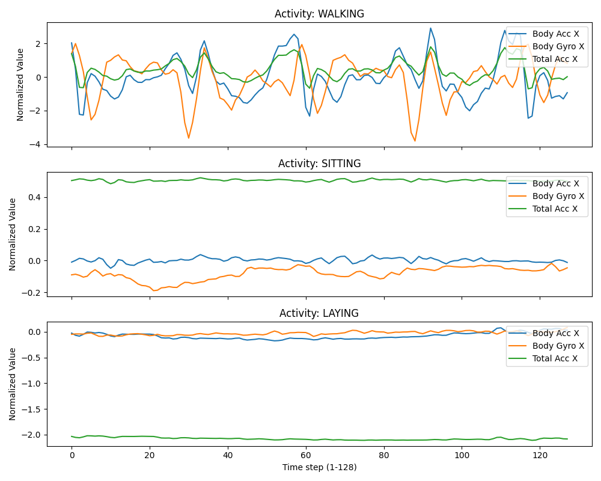
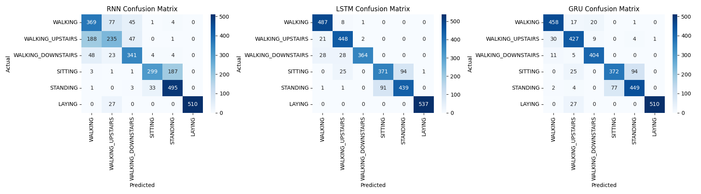
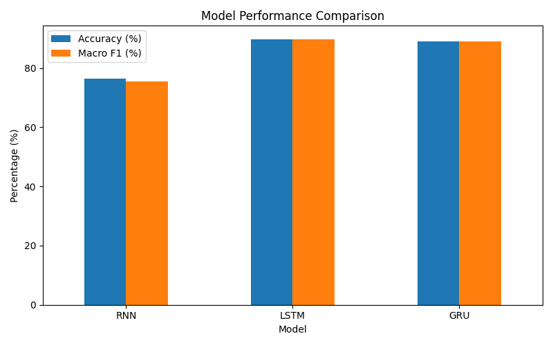
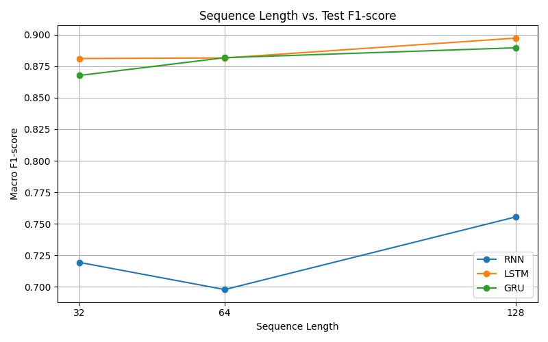
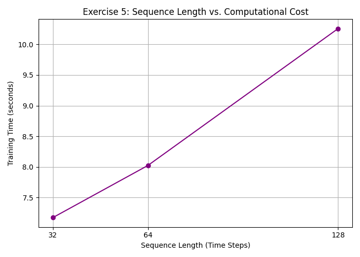
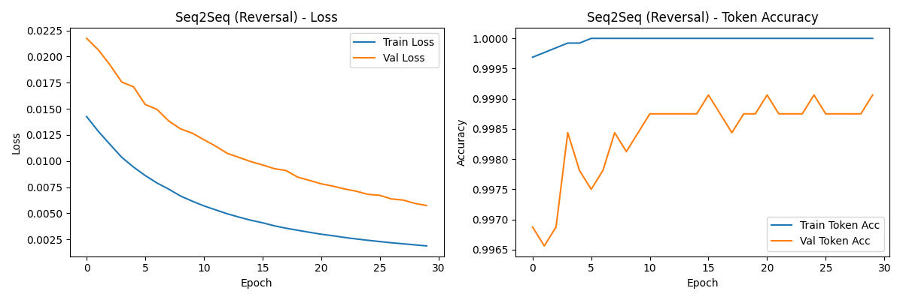
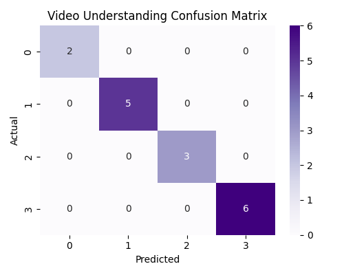

# Recurrent Neural Networks: SimpleRNN, LSTM, and GRU

This directory explores the application of Recurrent Neural Networks (RNNs), Long Short-Term Memory (LSTM), and Gated Recurrent Units (GRU) on various sequence modeling tasks. The primary implementations include time-series classification, video action recognition, and a sequence-to-sequence learning task.

## Table of Contents
- [Overview](#overview)
- [Requirements](#requirements)
- [Tasks & Architectures](#tasks--architectures)
  - [1. Time-Series Classification (UCI HAR)](#1-time-series-classification-uci-har)
  - [2. Video Action Recognition](#2-video-action-recognition)
  - [3. Sequence-to-Sequence (Reversal)](#3-sequence-to-sequence-reversal)
- [Results](#results)
  - [Model Comparisons](#model-comparisons)
  - [Advanced Architectures](#advanced-architectures)
  - [Effect of Sequence Length](#effect-of-sequence-length)
- [Visualizations](#visualizations)

---

## Overview

The `rnn-lstm-gru.ipynb` notebook implements several deep learning models to address different temporal tasks. Recurrent architectures are particularly suited for data where context and order matter, such as time series signals, frames in a video, or natural language sequences.

## Requirements

Install the necessary dependencies using the provided requirements file:

```bash
pip install -r requirements.txt
```

---

## Tasks & Architectures

### 1. Time-Series Classification (UCI HAR)
**Dataset:** Human Activity Recognition using Smartphones (UCI HAR) dataset. Sequences consist of 128 time steps with 9 sensor features per step.
**Objective:** Classify human activities (e.g., Walking, Sitting, Standing) based on inertial sensor data.

**Architectures Evaluated:**
- **SimpleRNN:** A basic recurrent layer (`SimpleRNN(32) -> Dropout -> Dense -> Dense(softmax)`).
- **LSTM (Long Short-Term Memory):** An advanced RNN with gating mechanisms to mitigate the vanishing gradient problem.
- **GRU (Gated Recurrent Unit):** A streamlined version of LSTM with fewer gates and parameters.
- **Stacked LSTM:** A deep recurrent network with two LSTM layers.
- **Bidirectional LSTM:** Processes sequences in both forward and backward directions to capture future context.

### 2. Video Action Recognition
**Dataset:** A synthetic video dataset consisting of 10-frame sequences (224x224 RGB) representing four different motion classes.
**Objective:** Predict the action class from a sequence of image frames.

**Architecture (CNN-RNN Pipeline):**
- **Feature Extractor:** `MobileNetV2` pretrained on ImageNet (plus `GlobalAveragePooling2D`) extracts 1280-dimensional spatial features per frame.
- **Sequence Model:** `LSTM(32)` or `GRU(32)` processes the 10 sequential feature vectors and outputs a classification via a Dense softmax layer.

### 3. Sequence-to-Sequence (Reversal)
**Dataset:** Synthetic integer sequences.
**Objective:** Train an Encoder-Decoder model to perfectly reverse a sequence (e.g., `[1, 5, 3, 2]` -> `[2, 3, 5, 1]`).

**Architecture (Encoder-Decoder LSTM):**
- **Encoder:** `LSTM(64)` processes the input sequence and outputs its final hidden and cell states (`state_h`, `state_c`).
- **Context Vector:** `RepeatVector` duplicates the encoder output across the target sequence length.
- **Decoder:** `LSTM(64)` initialized with the encoder's states reconstructs the reversed sequence.

---

## Reproducibility

To ensure consistent results and ease of reproducibility, the following practices were implemented:
- **Random Seeds:** A fixed `random_state=42` is used for all `train_test_split` operations to ensure data partitioning is identical across runs.
- **Subset Sampling:** To keep execution times reasonable for experimentation, the training process uses a stratified subset of 3,000 samples from the UCI HAR dataset.
- **Dependencies:** All exact library versions required to run this code without conflict are provided in `requirements.txt`.
- **Synthetic Data:** The video understanding and seq2seq tasks utilize synthetically generated data on-the-fly, eliminating the need for large external dataset downloads.

---

## Results

### Model Comparisons (HAR Task)

Comparing the performance of the three base architectures (32 units) on the test set:

| Model | Accuracy | Macro F1 | Parameters | Training Time (30 epochs) | Characteristics |
|-------|----------|----------|------------|---------------------------|-----------------|
| **SimpleRNN** | 76.31% | 75.55% | 1,974 | ~34.3s | Struggles to retain long-term dependencies across 128 time steps. |
| **LSTM** | 89.79% | 89.72% | 6,006 | ~31.8s | Highest accuracy, effectively captures temporal dynamics, more parameters. |
| **GRU** | 88.90% | 88.95% | 4,758 | ~28.8s | Highly competitive accuracy, computationally lighter and faster than LSTM. |

### Advanced Architectures

- **Stacked LSTM (2 layers):** Achieved **88.87%** test accuracy. Yields better feature representations by adding depth but requires more training time.
- **Bidirectional LSTM:** Achieved **89.72%** test accuracy. Improves upon standard configurations by utilizing context from both the past and the future of the sequence.

### Effect of Sequence Length (F1-Scores)

By truncating the sequence length (T=32, 64, 128), we observed a trade-off between context retention and computational cost:

| Sequence Length | RNN F1-Score | LSTM F1-Score | GRU F1-Score | LSTM Training Time (10 epochs) |
|-----------------|--------------|---------------|--------------|--------------------------------|
| **32** | 0.7194 | 0.8810 | 0.8675 | ~7.2s |
| **64** | 0.6978 | 0.8815 | 0.8817 | ~8.0s |
| **128** | 0.7555 | 0.8972 | 0.8895 | ~10.3s |

*Longer sequences provide more context, leading to higher F1-scores, but training time scales linearly with sequence length.*

### Other Task Results
- **Video Action Recognition:** Both LSTM and GRU models reached **1.0000 (100%)** test accuracy on the synthetic dataset, training in ~4.1 to 4.3 seconds.
- **Seq2Seq Reversal:** The Encoder-Decoder LSTM achieved **99.35%** token accuracy and **97.70%** perfect sequence accuracy.

---

## Visualizations

All generated plots during training and evaluation are saved in the `images/` directory.

### Sensor Signals


### Model Confusion Matrices (HAR)


### Model Performance Comparison


### Effect of Sequence Length



### Seq2Seq Reversal Training Curves


### Video Action Recognition Confusion Matrix

