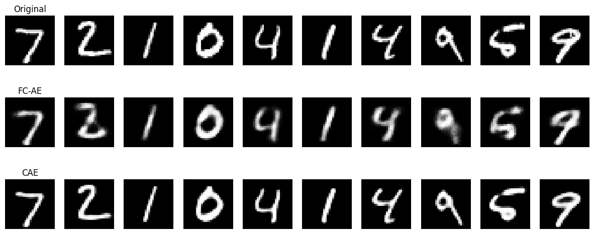
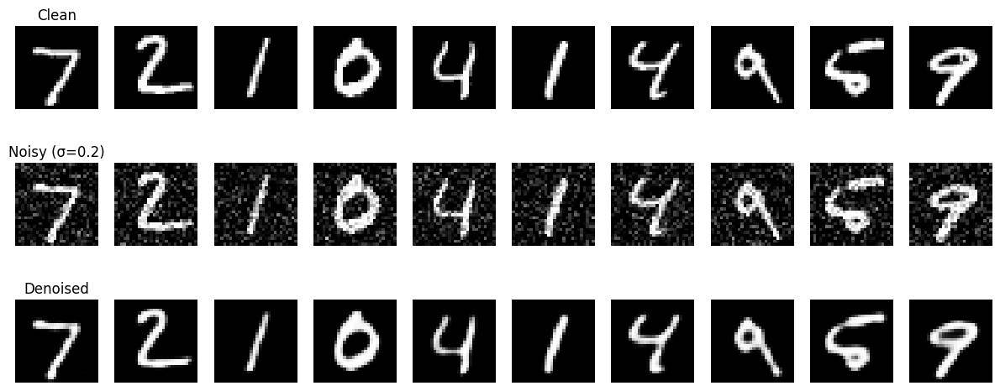
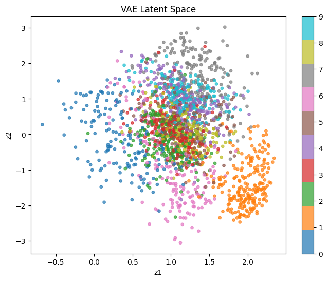
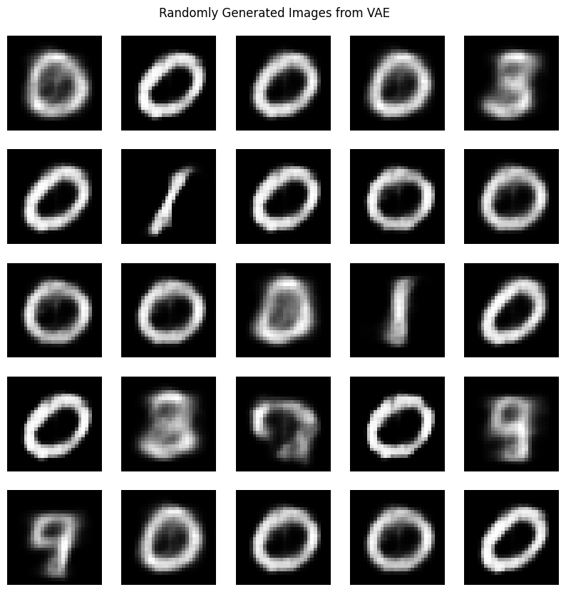

# Autoencoders: Fully Connected, Convolutional, Denoising, and Variational

This directory explores the application of various Autoencoder architectures on the MNIST dataset. The implementations include a Fully Connected Autoencoder (FC-AE), Convolutional Autoencoder (CAE), Denoising Autoencoder (DAE), and Variational Autoencoder (VAE).

## Table of Contents
- [Overview](#overview)
- [Requirements](#requirements)
- [Project Structure](#project-structure)
- [Tasks & Architectures](#tasks--architectures)
  - [1. Fully Connected Autoencoder](#1-fully-connected-autoencoder)
  - [2. Convolutional Autoencoder](#2-convolutional-autoencoder)
  - [3. Denoising Autoencoder](#3-denoising-autoencoder)
  - [4. Variational Autoencoder (VAE)](#4-variational-autoencoder-vae)
- [Results](#results)
- [Visualizations](#visualizations)

---

## Overview

The `auto-encoders.ipynb` notebook implements several deep learning models to address dimensionality reduction, image denoising, and generative modeling. The primary dataset used is a subset of the MNIST handwritten digits.

## Requirements

Install the necessary dependencies using the provided requirements file:

```bash
pip install -r requirements.txt
```

---

## Project Structure

```text
7_ae/
├── images/               # Directory containing all generated plots and visualizations
├── README.md             # Project documentation (this file)
├── report.pdf            # Detailed report of the experiments and findings
├── requirements.txt      # List of dependencies required to run the code
└── auto-encoders.ipynb   # Main Jupyter notebook containing all implementations and experiments
```

---

## Tasks & Architectures

### 1. Fully Connected Autoencoder
**Objective:** Basic dimensionality reduction and image reconstruction.
**Architecture:** A multi-layer perceptron (MLP) architecture flattening the 28x28 images into 784-dimensional vectors, compressing them into a latent space, and reconstructing the original input.

### 2. Convolutional Autoencoder
**Objective:** Improve spatial representation learning using convolution operations.
**Architecture:** Utilizes `Conv2D` and `MaxPooling2D` layers in the encoder to extract spatial hierarchies, and `UpSampling2D` with `Conv2D` in the decoder to reconstruct the image.

### 3. Denoising Autoencoder
**Objective:** Recover original images from corrupted (noisy) inputs.
**Approach:** Gaussian noise (varying $\sigma$) is injected into the input images. The model is trained to minimize the reconstruction loss against the clean original images.

### 4. Variational Autoencoder (VAE)
**Objective:** Learn a continuous, structured latent space suitable for generative tasks.
**Architecture:** Uses convolutional layers. Instead of mapping to a fixed vector, the encoder predicts the mean and log-variance of a normal distribution. A reparameterization trick is used to sample from this distribution. The model optimizes a combination of Reconstruction Loss and KL Divergence.

---

## Results

Comparison of the different autoencoder models on the MNIST test set:

| Model | MSE | MAE | SSIM | Parameters |
|-------|-----|-----|------|------------|
| **FC Autoencoder** | 0.0245 | 0.0636 | 0.7102 | ~211k |
| **Conv. Autoencoder** | 0.0030 | 0.0161 | 0.9706 | ~74k |
| **Denoising CAE (σ=0.2)** | 0.0054 | 0.0232 | 0.9365 | ~74k |
| **VAE** | 0.0505 | 0.1157 | 0.3989 | ~134k |

### Key Findings:
- **Convolutional Autoencoders** significantly outperform Fully Connected models in both MSE and SSIM, while using fewer parameters.
- **Denoising Autoencoders** successfully recover image structures even at moderate noise levels ($\sigma=0.2$).
- **Variational Autoencoders**, while having higher reconstruction error, learn a smooth latent space that enables generating entirely new digit samples and interpolating between different digits.

---

## Visualizations

All generated plots and images are saved in the `images/` directory.

### Autoencoder Reconstructions
Visual comparisons between Original, FC-AE, and CAE reconstructions.


### Denoising Performance
Clean vs Noisy vs Denoised images for $\sigma=0.2$.


### VAE Latent Space
Visualization of the 2D latent space learned by the VAE.


### VAE Generated Digits
Randomly sampled digits from the normal distribution decoded by the VAE.

